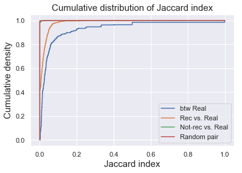
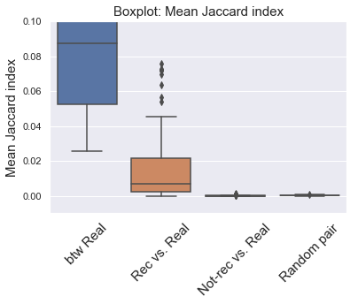

# **Making Song Recommendation with Neural Collaborative Filtering**

***
With the neural network collaborative filtering (NNCF), we are able to make song recommendation for existing playlists. Here we are using the NNCF model subset of 10,000 playlists genereated with a seed track (a popular song that belongs to >10,000 playlists) and demonstrate how we recommend new songs to those existing playlists. 
<br/><br/>
The idea is to choose the songs that have the highest scores predicted by the network when paired with a specific playlist. We can then compute the Jaccard index of recommended songs and existing songs, and compare it to the Jaccard index between existing songs, and that between not-recommended songs and exisiting songs. A good recommendation would have a high Jaccard index (comparable to Jaccard index between existing songs).

***
First we load all the libraries.

## Load data and model

***
Here we loaded the sparse matrix containing track-playlist contingency, as well as the NNCF model.


```python
# load files
sps_acc = scipy.sparse.load_npz('sparse_10000_rand.npz')

# convert matrix to csc type
sps_acc = sps_acc.tocsc()
sps_acc
```


    <171381x10000 sparse matrix of type '<class 'numpy.float64'>'
    	with 657056 stored elements in Compressed Sparse Column format>


## Define functions
***
Then we define several functions.

- ***recommend_tracks***
This function makes recommendation of tracks that are not currently in a specific playlist. It returns the list of tracks that were predicted by the network as class 1 but have real label class 0, sorted by the score.

- ***get_jaccard***
This function calculated the Jaccard index between a pair of tracks.

- ***create_unique_pair_subset*** and ***create_pairs_btw_lists*** help creating pairs of tracks from given lists.

## Make recommendation for one playlist
***
Here we randomly selecte a playlist, and make recommendation of the top 10 songs with the highest scores predicted by the NNCF model. We then compute Jaccard index between the recommended songs and existing songs (***rec vs. real***), and compare that to Jaccard index between exisitng songs (***btw real***), and Jaccard index between exisitng songs and 10 randomly selected non-recommended songs (***not-rec vs. real***). Jaccard inex for ***Rrandom pairs*** of tracks was also computed as baseline.


```python

```


    Mean Jaccard index
     rec vs. real = 0.016874325885359583 
     btw real = 0.06867752650047514 
     not_rec vs. real 0.00015570566551471537 
     random pair 0.00031485758244769997


### Visualize result
***
We can visualize the distribution of Jaccard index of 4 groups by plotting their empirical cumulative density functions. As we can see here, the ***rec vs. real*** group and ***btw real*** have distributions of higher Jaccard index, meaning that the tracks are similar to each other (even more similar for ***rec vs. real*** than ***btw real***), whereas the Jaccard index for ***not-rec vs. real*** group was really close to zero, comparable to ***random pairs*** of tracks. Therefore, the recommendation seems to be working well.


```python

```





## Scale up for 100 playlists
***
We can scale up our recommendation to 100 randomly selected playlists and look at the statistics of the Jaccard index of each group.

### Visualization 
***
The boxplot below shows the distribution of mean Jaccard index of the 4 groups for the 100 playlists. The ***btw real*** had the highest Jaccard index, indicating high similarity between each pair. The ***rec vs. real*** had low but above zero Jaccard index. Jaccard index for ***not-rec vs. real group*** was close zero, showing low similarity (as ***random pairs*** of tracks). 


```python

```


Zoomed in:


```python

```




