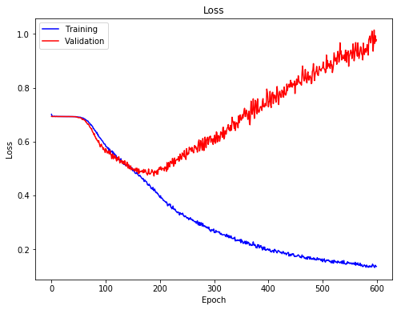
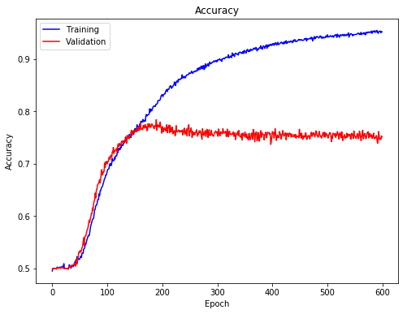
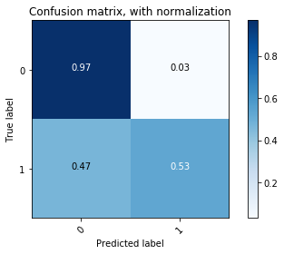
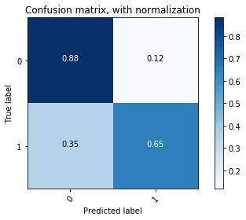

# Neural Collaborative Filtering (NNCF)
***
Besides classical matrix factorization, we also implemented the neural network version of collaborative filtering: using deep network model to perform matrix factorization, as well as allowing extra playlist-track mixing. 

The code implemented here was adopted from this 2017 WWW paper on __[Neural Collaborative Filtering](https://www.comp.nus.edu.sg/~xiangnan/papers/ncf.pdf)__ and a comprehensive __[blogpost](https://nipunbatra.github.io/blog/2017/neural-collaborative-filtering.html)__ written by Dr. Nipun Batra, Assistant Professor in Computer Science Department at IIT Gandhinagar. We applied the architecture of the NNCF model to the same subset of data consisting of randomly selected 10,000 playlists, training the network to perform binary classifcation on playlist-track pairs (predicting 0 vs. 1), and evaluated the model performance.

***
First we import the libraries.

## Load data and model

***
Here we loaded the sparse matrix containing track-playlist contingency.


```python
# load files
sps_acc = sps.load_npz('sparse_10000_rand.npz')
```


```python
# convert matrix to csc type
sps_acc = sps_acc.tocsc()
sps_acc
```


    <171381x10000 sparse matrix of type '<class 'numpy.float64'>'
    	with 657056 stored elements in Compressed Sparse Column format>


## Set up model architecture
***
For building the model, we need to determine the number of latent factors for the embedding layers of ***matrix factorization stream***, as well as those for the ***multilayer perceptron stream***, for both playlist and track inputs. We set the former to 50, and the latter to 10, as a simple start.


```python
# set latent factor number
n_tracks, n_playlists = sps_acc.shape[0], sps_acc.shape[1]
n_latent_mf = 50
n_latent_playlist = 10
n_latent_track = 10
```


## Network architecture
***
This architecture was adopted from the blogpost mentioned above. For the final prediction layer, we set it to a 2-unit dense connected layer for binary classification with softmax activation, and used binary crossentropy as loss function. We compiled the model with Adam optimizer, with a mild learning rate decay. 


```python
# build model
from keras.layers import Input, Embedding, Flatten, Dropout, Concatenate, Dot, BatchNormalization, Dense

# track embedding stream
track_input = Input(shape=[1],name='Track')
track_embedding_mlp = Embedding(n_tracks + 1, n_latent_track, name='track-Embedding-MLP')(track_input)
track_vec_mlp = Flatten(name='Flatten_tracks-MLP')(track_embedding_mlp)
track_vec_mlp = Dropout(0.2)(track_vec_mlp)

track_embedding_mf = Embedding(n_tracks + 1, n_latent_mf, name='track-Embedding-MF')(track_input)
track_vec_mf = Flatten(name='Flatten_tracks-MF')(track_embedding_mf)
track_vec_mf = Dropout(0.2)(track_vec_mf)

# playlist embedding stream
playlist_input = Input(shape=[1],name='Playlist')
playlist_vec_mlp = Flatten(name='Flatten_playlists-MLP')(Embedding(n_playlists + 1, n_latent_playlist,name='playlist-Embedding-MLP')(playlist_input))
playlist_vec_mlp = Dropout(0.2)(playlist_vec_mlp)

playlist_vec_mf = Flatten(name='Flatten_playlists-MF')(Embedding(n_playlists + 1, n_latent_mf,name='playlist-Embedding-MF')(playlist_input))
playlist_vec_mf = Dropout(0.2)(playlist_vec_mf)

# MLP stream
concat = Concatenate(axis=-1,name='Concat')([track_vec_mlp, playlist_vec_mlp])
concat_dropout = Dropout(0.2)(concat)
dense = Dense(200,name='FullyConnected')(concat_dropout)
dense_batch = BatchNormalization(name='Batch')(dense)
dropout_1 = Dropout(0.2,name='Dropout-1')(dense_batch)
dense_2 = Dense(100,name='FullyConnected-1')(dropout_1)
dense_batch_2 = BatchNormalization(name='Batch-2')(dense_2)
dropout_2 = Dropout(0.2,name='Dropout-2')(dense_batch_2)
dense_3 = Dense(50,name='FullyConnected-2')(dropout_2)
dense_4 = Dense(20,name='FullyConnected-3', activation='relu')(dense_3)

# end prediction for both streams
pred_mf = Dot(1,name='Dot')([track_vec_mf, playlist_vec_mf])
pred_mlp = Dense(1, activation='relu',name='Activation')(dense_4)

# combine both stream
combine_mlp_mf = Concatenate(axis=-1,name='Concat-MF-MLP')([pred_mf, pred_mlp])
result_combine = Dense(100,name='Combine-MF-MLP')(combine_mlp_mf)
deep_combine = Dense(100,name='FullyConnected-4')(result_combine)

# final prediction layer
result = Dense(2, activation = 'softmax', name='Prediction')(deep_combine)

# build model
model = keras.Model([playlist_input, track_input], result)

# compile model
opt = keras.optimizers.Adam(lr = 0.1, decay = 1e-5)
model.compile(optimizer='adam', loss= 'binary_crossentropy', metrics = ['accuracy'])
```


Here is the summary of the model.


```python

```


```python

```


    __________________________________________________________________________________________________
    Layer (type)                    Output Shape         Param #     Connected to                     
    ==================================================================================================
    Track (InputLayer)              (None, 1)            0                                            
    __________________________________________________________________________________________________
    Playlist (InputLayer)           (None, 1)            0                                            
    __________________________________________________________________________________________________
    track-Embedding-MLP (Embedding) (None, 1, 10)        1713820     Track[0][0]                      
    __________________________________________________________________________________________________
    playlist-Embedding-MLP (Embeddi (None, 1, 10)        100010      Playlist[0][0]                   
    __________________________________________________________________________________________________
    Flatten_tracks-MLP (Flatten)    (None, 10)           0           track-Embedding-MLP[0][0]        
    __________________________________________________________________________________________________
    Flatten_playlists-MLP (Flatten) (None, 10)           0           playlist-Embedding-MLP[0][0]     
    __________________________________________________________________________________________________
    dropout_1 (Dropout)             (None, 10)           0           Flatten_tracks-MLP[0][0]         
    __________________________________________________________________________________________________
    dropout_3 (Dropout)             (None, 10)           0           Flatten_playlists-MLP[0][0]      
    __________________________________________________________________________________________________
    Concat (Concatenate)            (None, 20)           0           dropout_1[0][0]                  
                                                                     dropout_3[0][0]                  
    __________________________________________________________________________________________________
    dropout_5 (Dropout)             (None, 20)           0           Concat[0][0]                     
    __________________________________________________________________________________________________
    FullyConnected (Dense)          (None, 200)          4200        dropout_5[0][0]                  
    __________________________________________________________________________________________________
    Batch (BatchNormalization)      (None, 200)          800         FullyConnected[0][0]             
    __________________________________________________________________________________________________
    Dropout-1 (Dropout)             (None, 200)          0           Batch[0][0]                      
    __________________________________________________________________________________________________
    FullyConnected-1 (Dense)        (None, 100)          20100       Dropout-1[0][0]                  
    __________________________________________________________________________________________________
    Batch-2 (BatchNormalization)    (None, 100)          400         FullyConnected-1[0][0]           
    __________________________________________________________________________________________________
    track-Embedding-MF (Embedding)  (None, 1, 50)        8569100     Track[0][0]                      
    __________________________________________________________________________________________________
    playlist-Embedding-MF (Embeddin (None, 1, 50)        500050      Playlist[0][0]                   
    __________________________________________________________________________________________________
    Dropout-2 (Dropout)             (None, 100)          0           Batch-2[0][0]                    
    __________________________________________________________________________________________________
    Flatten_tracks-MF (Flatten)     (None, 50)           0           track-Embedding-MF[0][0]         
    __________________________________________________________________________________________________
    Flatten_playlists-MF (Flatten)  (None, 50)           0           playlist-Embedding-MF[0][0]      
    __________________________________________________________________________________________________
    FullyConnected-2 (Dense)        (None, 50)           5050        Dropout-2[0][0]                  
    __________________________________________________________________________________________________
    dropout_2 (Dropout)             (None, 50)           0           Flatten_tracks-MF[0][0]          
    __________________________________________________________________________________________________
    dropout_4 (Dropout)             (None, 50)           0           Flatten_playlists-MF[0][0]       
    __________________________________________________________________________________________________
    FullyConnected-3 (Dense)        (None, 20)           1020        FullyConnected-2[0][0]           
    __________________________________________________________________________________________________
    Dot (Dot)                       (None, 1)            0           dropout_2[0][0]                  
                                                                     dropout_4[0][0]                  
    __________________________________________________________________________________________________
    Activation (Dense)              (None, 1)            21          FullyConnected-3[0][0]           
    __________________________________________________________________________________________________
    Concat-MF-MLP (Concatenate)     (None, 2)            0           Dot[0][0]                        
                                                                     Activation[0][0]                 
    __________________________________________________________________________________________________
    Combine-MF-MLP (Dense)          (None, 100)          300         Concat-MF-MLP[0][0]              
    __________________________________________________________________________________________________
    FullyConnected-4 (Dense)        (None, 100)          10100       Combine-MF-MLP[0][0]             
    __________________________________________________________________________________________________
    Prediction (Dense)              (None, 2)            202         FullyConnected-4[0][0]           
    ==================================================================================================
    Total params: 10,925,173
    Trainable params: 10,924,573
    Non-trainable params: 600
    __________________________________________________________________________________________________


## Spliting data
***
We split 5% of the data from the whole dataset, and distributed the 5% equally into validation and test set. From the summary statistics, we can see that the matrix is really sparse: only ~0.03% of pair had class 1 labels. 


```python

```


    # of all sample = 1713810000
    proportion of ones in all samples = 0.00038338905713002026
    # of split samples = 32679
    proportion of ones in split sample = 0.00038136082762966724


A trick here: We masked the splited data by setting the value to 2, and later excluded them during training process.


```python

```


    /Users/shihyitseng/anaconda3/lib/python3.6/site-packages/scipy/sparse/compressed.py:746: SparseEfficiencyWarning: Changing the sparsity structure of a csc_matrix is expensive. lil_matrix is more efficient.
      SparseEfficiencyWarning)


## Define training data generator
***
One important step we took for training was to artificially ***balance the class labels***. Since the class 1 pairs were extremely sparse, a network trained on the original data can end up predicting everything to 0. Actuaslly that was what we got when we started with the naive way. In the current version we presented here, the training generator yielded augemented data with equalized class number. This would force the network to pay more attention on the class 1 samples, and bias the network to have a higher prior to class 1 than the real prior (which was around 0.1%). But the "high" false positive rate is actually what we want! We need to make recommendation on extending the songs in a playlists, and the "false positive" samples would be the candidates for recommendation.

The validation generator was defined similarly, generating samples from the validation set with equalized class number.

## Model training
***
We set up checkpoints during the training process, saving models every 10 epochs. Later we can look at the training history and pick a model based on ***validation loss***, since the model can overfit during the extended training process (total 500 epochs).

## Training history
***
Plotted below is the training/validation loss during the training process. Both the training/validation loss dropped rapidly during the first 100 epochs, and and started to slow down between epoch 100 to 200. The training and validation loss started to diverge after epoch 200, as the training loss kept going down but the validation loss started to increase. 


```python

```





We can also look at the accuracy of training and validation data. It reflected similar trend as indicated by the loss.


```python

```





## Function to plot confusion matrix
***
We used the visualization function for confusion matrix from __[sklearn website](https://scikit-learn.org/stable/auto_examples/model_selection/plot_confusion_matrix.html#sphx-glr-auto-examples-model-selection-plot-confusion-matrix-py)__.

## Evaluate the model
***
First, we evaluted the performance of the final model on test set. The accuracy was 97% before class balancing, and 75% after class balancing, which was really close to the training and validation performance at the final epochs.


```python

```


    42845250/42845250 [==============================] - 1265s 30us/step
    Loss on test data = 0.0913167645157834 
    Accuracy on test data = 0.9683511357735105


```python

```


    Loss on test data = 0.9937882089614868 
    Accuracy on test data = 0.7507510006427764


## Prediction and confusion matrix
***
We then made the prediction on test data and plotted confusion matrix (both non-normalized and normalized). The final model had sensitivity 53% (predicting class 1 from real class 1) and specificity of 97% (predicting class 0 from real 0). Notice that there were a lot of false positive samples, since we have an extremely unbalanced class ratio. Those samples would potentially be the ones that we make recommendation on.


```python

```


    predicted proportion of ones = 0.031673802813614114


```python

```


    Confusion matrix, without normalization
    [[41480535  1348361]
     [    7643     8711]]


```python

```


    Normalized confusion matrix
    [[0.96851749 0.03148251]
     [0.46734744 0.53265256]]





We can also quantify the model performance using area under ROC.


```python

```


    auROC = 0.7505850277437294


## Evaluation and prediction with the model of lowest validation loss
***
Since the final model might be a little bit overfitting according to the training histry, we went back and found the model with lowest validation loss (around epoch 220) that we saved as checkpoints, and evaluated the performance with it. 


```python

```


    42845250/42845250 [==============================] - 1337s 31us/step
    Loss on test data = 0.3521598268120076 
    Accuracy on test data = 0.8817210542592236


```python

```


    Loss on test data (class balanced) = 0.4995765554904938 
    Accuracy on test data (class balanced) = 0.764355999827385


We can see that the final model and the model with lowest validation loss performed similarly on class balanced test data (75% vs. 76%), but the final model out-performed on the test data with real class ratio (97% vs. 88%).
***
We can look at the confusion matrix, too.


```python

```


    predicted proportion of ones = 0.11839219049953029


```python

```


    Confusion matrix, without normalization
    [[37766956  5061940]
     [    5751    10603]]


```python

```


    Normalized confusion matrix
    [[0.88181017 0.11818983]
     [0.35165709 0.64834291]]





```python

```


    auROC = 0.7650765407927385


The model with lowest validation loss had a higher sensitivity (65%) and lower specificity (88%) compared to the final model. The area under ROC was similar. 

## Comparison between models
***
When we looked at the normalized confusion matrix, we found that this model gave higher sensitivity on class 1 samples but lower specificity on class 0 samples compared to the final model. Since the validation data was also sampled in a class-balance way, it is biased toward the balanced statistics. But when we trained the model for longer, it learned the closer-to-real statistics of the original data, so it did well on the test set with original class values. The area under ROC metric for both models were quite similar. We think that both models were fine. The final model might give better accuracy on predicting playlist-track contingency, thus a talored recommendation to individual playlists, whereas the model with lowest validation loss had higher "false positive rate", which would generate a more extended list of recommendation.
